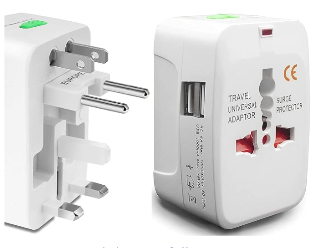

# Adapter

* **Primary Goal**: To make two previously incompatible interfaces work together without modifying their source code.

* **Focus**: Interface Conversion. It focuses on to give us the interface we require from the interface we have.

* **Process**: Wrapping

* **When to Use**: When you want to use an existing class but its interface doesn't match the one your application needs. 

**Analogy**
A headphone jack adapter (e.g., converting a large $6.35 \text{ mm}$ jack to a small $3.5 \text{ mm}$ jack). The adapter doesn't change the headphones or the device; it just translates the connection.

or

i bought laptop in India i travelled to London, there sockets are different so i bought a adapter

## Table of content
1. [Adapter](./Adapter.cpp)
2. [Cache Adapter](./CacheAdapter.cpp)