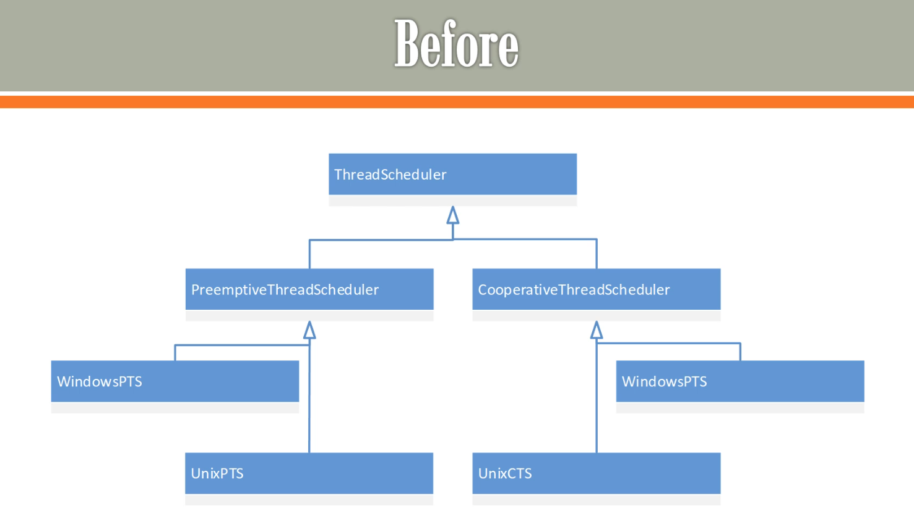
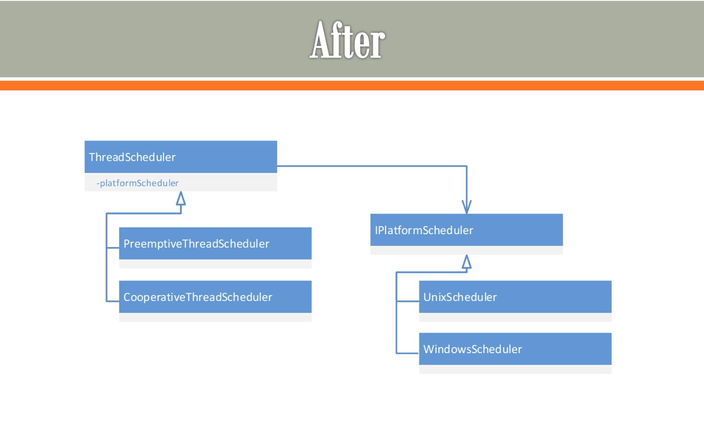

# Bridge

* **Primary Goal**: To decouple an abstraction from its implementation so that the two can vary independently.

* **Focus**: Two Independent Hierarchies. It splits a large class structure into two separate inheritance hierarchies (Abstraction and Implementation) that are connected via composition (the "bridge").

* **Process**: Decoupling / Composition

* **When to Use**: When you have a class that needs to be extended in two or more dimension, and you want to avoid a huge, unmanageable class hierarchy explosion.

**Analogy**
consider a scenerio we have to implement `ThreadScheduler`

There are two types of ThreadScheduler
* Preemptive
* Cooerative

ThreadScheduler has to run on `Windows` and `Unix`, so we end up with $2\times2$ scenario: `WindowsPET`,
`UnixPET`, `WindowsCPT`, `UnixCPT`.

Using bridge we can implement like this

## Table of content